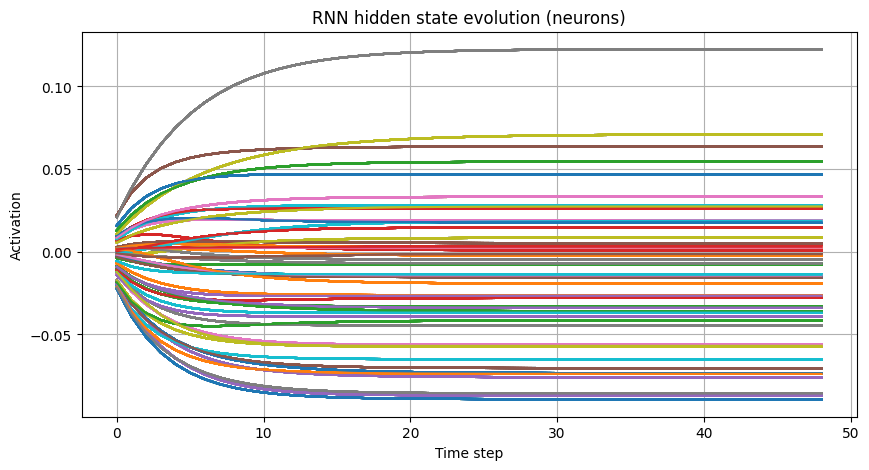

# ODE based Physical Neural Network (PNN) trained with model-free methods

This Github repo contains all my code implementing an ODE based dynamical system and using it as a recurrent neural network. This is done to study model-free optimization on a physically plausible NN structure. All the code is implemented using pytorch and numpy. I used ChatGPT  to format my markdown (don't have time to learn it ). Here is a small overview of the most important files I use. 

## 🧠 `NN_utils.py` – Custom Neural Network Utilities

This module defines several custom PyTorch models and training routines, including both standard and physics-inspired recurrent neural networks. It provides modular, extensible tools for training neural networks using either backpropagation or gradient-free black-box optimization methods.

---

### ✅ Key Components

#### 🧩 `Base_Model`
- Base class for all models.
- Provides utilities to:
  - Count trainable parameters.
  - Get/set model weights as flat NumPy arrays.
  - Perform stateless forward passes (useful for black-box optimizers), forward_pass_params.

#### 🔁 `Oscillator_RNN_dyn` – Dynamical Recurrent Neural Network (**Used**)
- Custom RNN inspired by nonlinear oscillator dynamics.
- Each layer’s hidden state evolves over time using a discretized differential equation:

$$
\dot{\mathbf{h}}^{[l]}(t) = -\alpha \mathbf{h}^{[l]}(t) + \boldsymbol{\beta}^{[l]} \cdot \sin\left(W_{\text{rec}}^{[l]} \mathbf{h}^{[l]}(t) + \gamma W_{\text{in}}^{[l]} \mathbf{h}^{[l-1]}(t) + \mathbf{b}^{[l]}\right) + \mu \mathcal{N}(0, 1) , \text{for}~h>1
$$
This PNN simulates a network of of coupled nonlinear oscillator nodes with the input being $h^{[0]}$, like MNIST images. Layers use **sparse, spectrally normalized** weights via a custom `SparseLinear` module to promote stability, weights are also symmetric to implement bi-directional coupling common in physical systems. I was previously using a small feedback $\alpha = 0.9$ but then the network needed 300 steps to reach steady state, that is too long and makes the code run slow. Right now I use $\alpha = 3$. $W_{\text{rec}}$ is left untrained for memory independent tasks like MNIST or FashionMNIST. The implementation is in the forward method.

When using the network to perform memory-independent tasks we wait for it to reach steady state:

- Integration is realized via a simple explicit Euler method with a small enough step size to resolve the transients.
- Integration continues until the system reaches a **steady state**, defined by a maximum change threshold (`eps_int`) or a step limit (`max_steps`).
- While the integration goes on the input data is "clamped" till steady state is reached, at which point we get the corresponding output for that input.

To check steady state I made a handy script called "Oscillator_RNN_ssdyna_check.py" (very original I know):
Here are some pictures of the activation states : 

This plot allows us to set the max number of steps for integration if needed.

#### 🧪 Other Models
I used these mainly for debugging when I lost faith... Particularly the time independent models since they run much faster x30 since there is no time loop.
- `RNN_network`: Vanilla RNN using PyTorch’s built-in `nn.RNN`.
- `Custom_RNN`: Layered sinusoidal RNN with fixed-time evolution.
- `Linear_model`, `simple_FFNN`, `Tiny_convnet`: Lightweight models for debugging and benchmarks.

---

### ⚙️ Training Utilities

- `train_BP_torch`: Standard backpropagation training loop using `torch.optim`.
- `train_online_pop_NN`: Evolutionary-style population-based optimization loop (PEPG, CMAES if you have the patience of a Shaolin monk, particle swarm if you are a clinically insane).
- `train_online_SPSA_NN`: Black-box training with Simultaneous Perturbation Stochastic Approximation (SPSA), optionally enhanced with Adam.

---

## ⚙️ `optimization_algorithms.py` – Black-Box Optimizers

This script implements several gradient-free and low-level optimization algorithms, which can be used to train neural networks without backpropagation. These are especially useful for models with non-differentiable components or when gradient computation is impractical.

---

### 🧮 Included Optimizers

#### 🔹 `AdamOptimizer`
- Custom implementation of the classic Adam optimizer in NumPy.
- Maintains first- and second-moment estimates.
- Returns a parameter update step given an external gradient.

---

#### 🔹 `SPSA_opt` – Simultaneous Perturbation Stochastic Approximation
- Approximates gradients using only **two evaluations** regardless of parameter count.
- Useful for noisy and high-dimensional problems.
- Supports:
  - Gradient estimation from function calls or precomputed loss values.
  - Parameter updates with or without external steps (e.g. Adam-based).

---

#### 🔹 `CMA_opt` – Covariance Matrix Adaptation Evolution Strategy
- Re-implementation of the original CMA-ES algorithm by Nikolaus Hansen.
- Uses a multivariate normal distribution with adaptive covariance matrix.
- Features:
  - Rank-based selection and weighted recombination.
  - Adaptation of step size (`sigma`) and covariance.
  - Eigen-decomposition-based updates.

---

#### 🔹 `PEPG_opt` – Policy Evolution with Parameter-based Exploration
- Based on work by David Ha.
- Evolves parameters using symmetric perturbations and reward-based updates.
- Features:
  - Per-parameter adaptive noise (`sigma`).
  - Centered rank-based fitness scaling (optional).
  - Learning rate and noise decay over time.

---

These optimizers can be plugged into any model that supports a `.forward_pass_params()` method, such as those in `NN_utils.py`.

##  Other scripts / notebooks:

I have many other scripts then that call function / classes of the two most important .py files explained above. These other scripts are often organized in the following structure: 

 - Initialize datasets
 - Initialize model and model hyperparameters (number of neurons etc ...)
 - Initialize optimizer and learning hyperparameters (learning rate popualtion size and other shenanigans)
 - Call the training function
 - save data and plot it
 - often a for loop around this to study hyperparameter behavior

##  Saving Data:

Data is saved using the Pickle library which allows for saving variables and importing them back in python, I think dealign with just .txt or .csv is mad. The training funcitons return a dictionary "D" which has the following self explanatory keys: 

D = ['train_loss' : train_loss,
        'test_loss':test_loss ,
        'test_acc' : test_acc ,
        'time' : train_time,
        'n_params': model.count_parameters()]

Over many loops when scanning parameters, D is appended to a variable I call results which is the one saved with Pickle.
## References and useful resources

 - My previous simpler repo that implements the model free algorithms used here: https://github.com/ASkalli/learning_strategies and the related arxiv paper : https://arxiv.org/abs/2503.16943
 - This amazing blogpost : [https://blog.otoro.net/2017/10/29/visual-evolution-strategies/](https://blog.otoro.net/2017/10/29/visual-evolution-strategies/) . By D. Ha, very valuable resource. I basically used it to understand the basic concepts, and based some of my code on it.
 - 

CMAES: Here are some really nice tutorials by the inventor of CMAES Nikolaus Hansen, he also provides matlab and python code on his website, I used that as a basis for the python class I included.

-   [https://arxiv.org/abs/1604.00772](https://arxiv.org/abs/1604.00772)
-   [https://www.youtube.com/watch?v=7VBKLH3oDuw](https://www.youtube.com/watch?v=7VBKLH3oDuw)

A series of youtube videos by a youtuber called cabagecat that explains the blog more in detail and is nice for intuition

-   [https://www.youtube.com/watch?v=5qCAOyNJROg](https://www.youtube.com/watch?v=5qCAOyNJROg)

PEPG:

[https://people.idsia.ch/~juergen/nn2010.pdf](https://people.idsia.ch/~juergen/nn2010.pdf)

[https://www.jmlr.org/papers/volume15/wierstra14a/wierstra14a.pdf](https://www.jmlr.org/papers/volume15/wierstra14a/wierstra14a.pdf)

